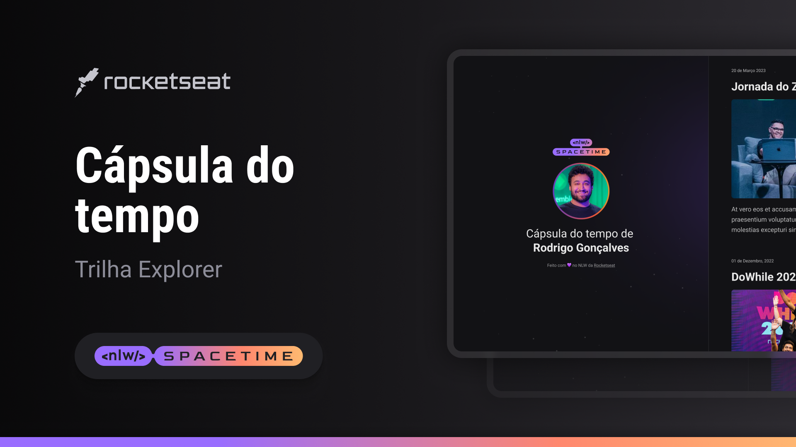

  

## 💻 Projeto 

Esse é um Projeto responsivo de uma cápsula do tempo e fiz minha versão sendo uma cápsula de música de um cantor que gosto muito.

## 🚀 Tecnologias

Esse projeto foi desenvolvido durante a NLW da Rocketseat com as seguintes tecnologias:

- HTML
- CSS
- Git e Github

## 🏷️ Layout

Você pode visualizar o layout do projeto através 
[desse link](https://www.figma.com/file/4NLUiD2omb3XI2rSJ0Qe2y/C%C3%A1psula-do-tempo-%E2%80%A2-Trilha-Explorer-(Community)-(Copy)?type=design&node-id=0%3A1&t=BZLPBnT6ZtKb454v-1)
É necessário ter uma conta no [Figma](https://www.figma.com/)